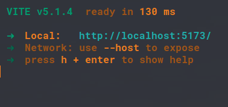

# Instructions

This is intended to be learning material for React

[The code is taken from the react-ui-component folder of the datastack_kubernetes_poc repository](https://github.com/c-x-g/datastack_kubernetes_poc/tree/master/react-ui-component)

The only difference is that I have removed the API call and replaced it with static data so that the focus is on showing the React functionality

# Setup

1. Assuming completed setup of npm and yarn, (I can include those steps if necessary)
   Run these commands:

```
yarn install
yarn dev
```

If there are no errors, the default port is 5173, you should see something like this


2. Go to your browser to the corresponding address shown in the terminal, a page should render showing a navigation bar on the top right and a button in the middle


3. Click the **Call API Pod** button and go to the **Access Table** page by clicking the Nav link on the top right and you should see the pages behave as shown below

**Call API**


<br/>

**Call Table**

